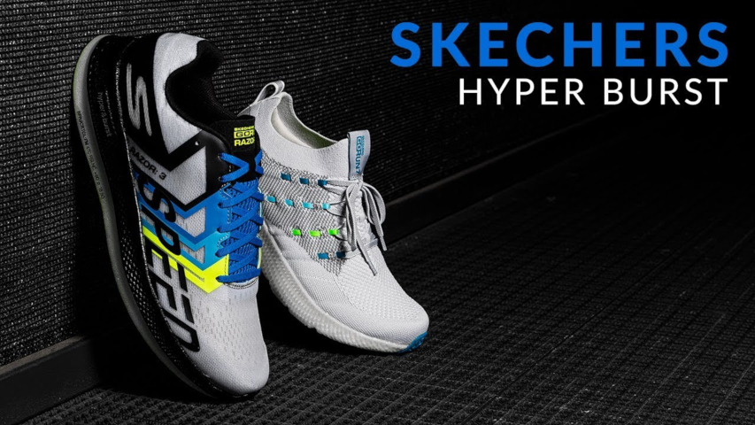
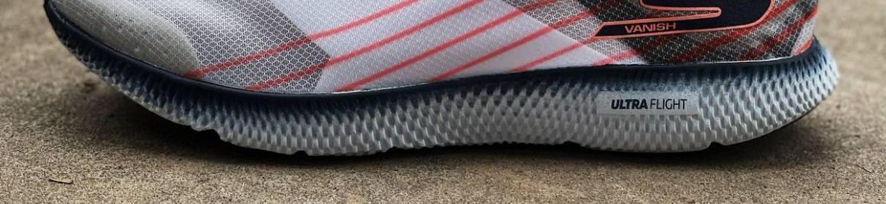
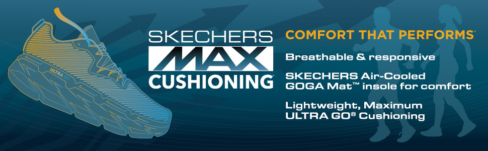
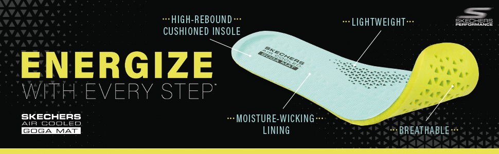
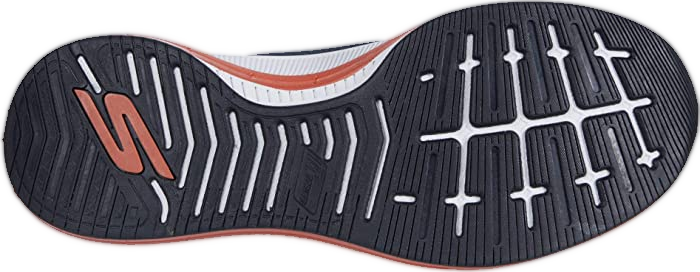
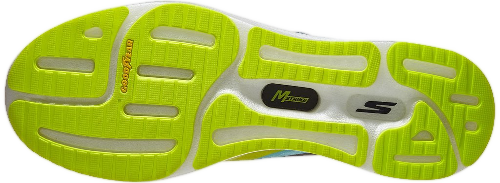
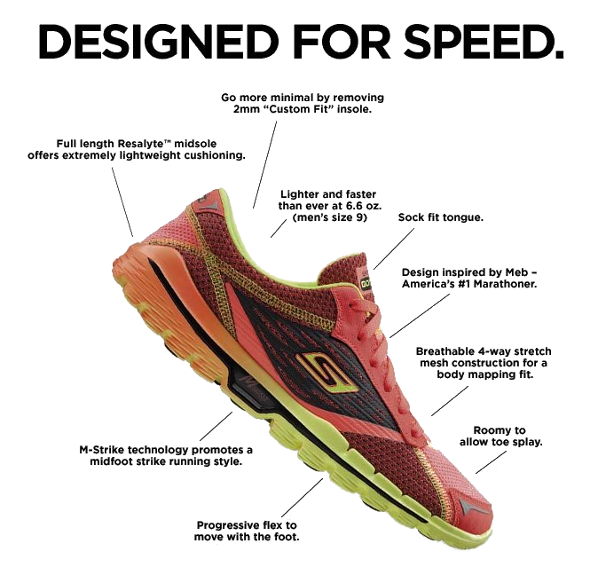
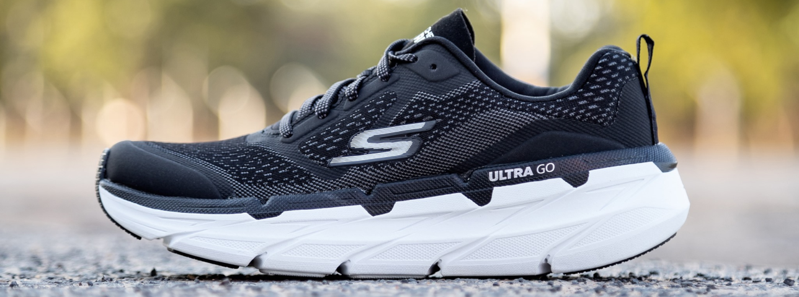
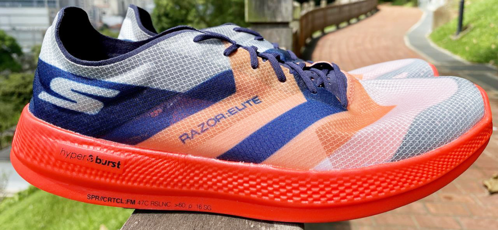

# Skechers

Rebels, not like the others. Slim, cool, comfortable, and cheap. Also my favorite running shoe brand.

4-6mm drop, low to high stack, any type of the upper you may wish for. The brand started as a somewhat copycat and developed a huge variety, but with a twist.

To clarify, most of my actual running shoes were made by them. Most of the early-day ones, at least. And you know, why? They are pretty much always the best option within a low budget. Hands down, not even a competition. For $50-100, you would be able to get what, Nike Downshifter? Some low-tier Adidas shoe made from a slab of generic EVA and a shitty upper? With Skechers, you would be able to get something like Go Run Pure or Pulse with decent midsole, a nice sock liner, and a really nice upper. With a tech from a previous generation, sure. But it was top of the line someday. 

Or you can even get current top of the line shoe on clearance. GOmeb Speed 6 with HyperBurst was that much for the whole autumn of 2020 on RunningWarehouse. They like good deals. You're not going to see them 24/7 like with Puma's old models, but the deals are off the charts.

But should you buy them for full price? Some - yes. I've bought 3 pairs of GoRun Ride 7, and only the first and the last one had a discount. But the brand shines at the lower price points. 

## Technology

### Hyper Burst

Super-critical nitrogen-injected EVA midsole material. Plenty of bounce, little to no compression at the usual mileage. Used as an independent blob (Ride 8), as a cage to Pebax (Speed 6 Hyper), and with a carbon plate (Speed Elite). Stack height varies.

- Lifespan - 700km or more
- Softness - Softer
- Bounce - Fine
- Support - Minimal

### Ultra Flight

A rebranding of FlightGen - molded EVA midsole debuted in Ride 7. Some sources claim it is actually a TPU, but I had four pairs of shoes with that midsole and cannot support the statement - there is no TPU in it. One of the lightest blends there is, able to compete even with the HyperBurst. Plain and basic ride otherwise, which are not bad. Was the best midsole material a few years ago. Still nice to run in.

- Lifespan - 600km or less
- Softness - Regular
- Bounce - Small
- Support - None

### Ultra GO

Modified older 5Gen midsole. Pure EVA.  Nicely cushioned, gets the job done. Sometimes used as an outsole without marginal addition of rubber or none at all. Used with Mstrike to provide at least some support

- Lifespan - 500km or less
- Softness - Soft
- Bounce - Small
- Support - None
- Tracktion - Bad

### Air-Cooled Goga Mat

An insole you want to see in any of your shoes. No, really, there are o lot of great ones, but Skechers takes the cake with no competition. Your feet will breathe. The only insole I can run comfortably in at 30+C. Sustains its form, but adapts to your foot on the run.

- Lifespan - Forever (?)
- Softness - Very Soft
- Bounce - None
- Support - Minimal

### Skechers Rubber

Regular rubber you may find in their most consumer-oriented shoes. 

- Lifespan - 500km or less
- Softness - Soft
- Traction - Regular
- Support - Varies

### Good Year Rubber

Branded tire-level outsoles to compete with Continental rubber in Adidas shoes. Can be seen in mostly flat and pieced patterns on road shoes. 

- Lifespan - 500km or more
- Softness - Fine
- Traction - Excellent
- Support - Minimal

### MStrike

Stands for "midfoot strike". At first, supposed to create a better foot strike with rubber between EVA layers acting like a spring, preceding plated shoes by quite a margin. But that is in the past. Today it marks Skechers outsoles with dual-density midsoles. The difference is marginal in most cases, so whatever.

### Everyday upper

Nice upper for everyday use. Not very breathable or light by itself, but not something that would give you any discomfort. On a contrary, typically very comfortable. Sizing and lock-down just right for any shoe with it.

- Lifespan - 500km or more
- Lock-down - Great
- Form - Great

### Race upper

The razor-thin see-through upper is used in top racing models. Think of the Nike Vaporfly upper. Practically invisible, but looks and feels good. Lock-down is great, but sizing is off. Looks like a sock-less upper, but I would not suggest you try. Very fragile.

- Lifespan - 250km, varies
- Lock-down - Great
- Form - Off

## Shoes to consider

### GOrun Ride

The best overall. A bit heavy, but light enough. Sturdy upper, best midsole/outsole combinations are available. Always fun to run in. A discounted version of the previous iteration is usually rebranded and sold as GOrun Pure.

- Drop - 6mm
- Type - Neutral
- Speed - 3:30+ min/km
- Lifespan - 500km or more

### GOrun Razor+

### GOmeb Speed Hyper

Hyper Burst with cached Pebax blob. Light-thin upper for maximum breathability and minimum weight. 

- Drop - 4mm
- Type - Race
- Speed - 2:40-4:30 min/km
- Lifespan - 250-400 km due to fragile upper

## The Good

- Affordable;
- Great midsoles;
- Perfect shoe geometry.

## The Bad

- Cheap;
- Upper may be janky;
- The shoes are not equally available in the world.

## Verdict

- Typical lifespan - 300-500km (due to the upper or the outsole);
- Good for - Everyone

The best choice for beginners and amateur runners. But the pros would not be disappointed either.